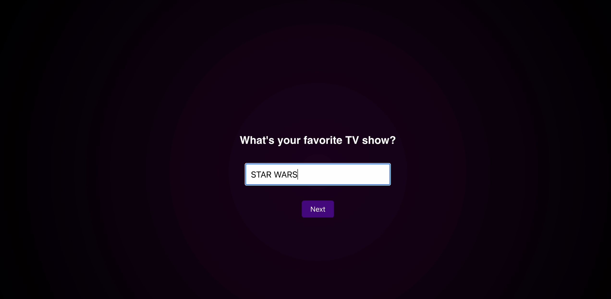

# 📚 MyTutor.ai – Personalized AI Tutoring Experience

Welcome to MyTutor.ai, a personalized AI-powered tutoring site designed to make learning engaging, intuitive, and fun by adapting to each student’s unique personality and interests.

## 🧭 How It Works

## 🚀  Landing Page
### The user is greeted with a welcoming and intuitive interface to begin the journey.

## ⭐  Step 1: User Favorites
#### Users select their favorite:
#### - TV shows
#### - Movies
#### - Games
#### These selections are sent to the Qloo API to begin building a taste profile.
#### The Qloo API then returns similar media. If the user says they like the media suggested, it is added to their profile and informs any further searches

## 🎭 4. Step 2: Avatar & Personality Creation
#### GPT-4.1 uses the taste profile generated by Qloo and learning background to generate a tutor avatar with:
#### - Personality traits (e.g., calm, energetic, funny)
#### - Clothing styles
#### - Skin tone

## 🤖 6. Step 5: Tutor Agent Activation
#### Once the avatar is complete the Tutor Agent (GPT-4.1) is activated.
#### 
#### The user is taken to the live tutoring page, which includes:
#### - Top Right: AI whiteboard for step-by-step guidance
#### - Bottom Right: User’s whiteboard for working out problems
#### - Left Panel: Avatar and live conversation area

# Here, the Tutor AI agent can dynamically:
#### - Generate personalized educational content and whiteboard content
#### - Communicate through the avatar in the top-left of the screen
#### - Adapt teaching style to the student’s responses

## 🖥️ Tutoring Interface

## 🔄 Data Flow Diagram

### Above is a visual overview of how data flows through the platform.

# 🛠️ Technologies Used

- React.js – Frontend
- Flask / Node.js – Backend
- OpenAI GPT-4.1 – Tutor & Customization Agents
- Qloo API – Taste Profiling

# 👩‍🏫 Future Features

- Parent/Teacher dashboard for tracking progress
- Parent/Teacher determined weekly goals 
- Upload class curriculum for guided help
- Text-to-speech narration

